# Архитектура стриминговой платформы с системой подписок

## Общий обзор

Стриминговая платформа представляет собой монолитное приложение с модульной структурой, разработанное с учетом возможного перехода к микросервисной архитектуре в будущем. Система состоит из трех основных клиентских компонентов и серверной части.

## Технологический стек

### Фронтенд

- **Веб-клиент**: React с TypeScript, Redux для управления состоянием
- **Административная панель**: React с TypeScript, Redux, с использованием тех же компонентов, что и веб-клиент
- **Мобильное приложение**: Progressive Web Application (PWA) на основе React с TypeScript для кроссплатформенного доступа

### Бэкенд

- **Основной сервер**: NestJS (Node.js с TypeScript)
- **Медиа-сервер**: Ant Media Server
- **Контейнеризация**: Docker и Docker Compose

### База данных и кэширование

- **Основная БД**: PostgreSQL с Prisma ORM
- **Кэширование**: Redis для сессий, кэширования и очередей сообщений

## Модульная структура бэкенда

Монолитный бэкенд на NestJS будет разделен на модули, каждый из которых отвечает за определенную функциональность. Это позволит в будущем легко выделить отдельные модули в микросервисы.

### Модуль аутентификации

- Интеграция с Telegram API для авторизации
- Управление JWT-токенами
- Проверка прав доступа для администраторов

### Модуль пользователей

- Управление профилями пользователей
- Разделение на роли (зрители, стримеры, администраторы)
- Управление администраторами (@art_om108, @maximkorobkov и др.)

### Модуль подписок

- Гибкая система настройки подписок
- Управление подписками пользователей

### Модуль платежей

- Интеграция с криптоплатежными шлюзами (BTC, ETH, USDT)
- Подготовка к интеграции с фиатными платежами

### Модуль стриминга

- Интеграция с Ant Media Server через REST API
- Управление стримами (создание, остановка, мониторинг)
- Интеграция с YouTube и Rutube API

### Модуль уведомлений

- Отправка уведомлений о начале трансляций
- Push-уведомления для мобильных устройств
- Интеграция с Telegram для отправки сообщений

### Модуль календаря

- Управление расписанием мероприятий
- Назначение стримеров на мероприятия
- Публикация календаря для пользователей

### Модуль аналитики

- Сбор данных о просмотрах, подписках, платежах
- Генерация отчетов для администраторов
- Фильтрация данных по различным параметрам

## Схема базы данных

## API-интерфейсы

### REST API

#### Аутентификация

- `POST /api/auth/telegram` - Авторизация через Telegram
- `POST /api/auth/refresh` - Обновление токена
- `GET /api/auth/me` - Получение информации о текущем пользователе

#### Пользователи

- `GET /api/users` - Получение списка пользователей (для админов)
- `GET /api/users/:id` - Получение информации о пользователе
- `GET /api/users/me` - Получение информации о текущем пользователе
- `GET /api/users/me/profile` - Получение профиля текущего пользователя
- `PATCH /api/users/:id` - Обновление информации о пользователе
- `POST /api/users/admins` - Создание нового администратора (для админов)

#### Кошелек

- `GET /api/wallet/balance` - Получение баланса кошелька
- `POST /api/wallet/deposit` - Пополнение кошелька
- `GET /api/wallet/transactions` - Получение истории транзакций

#### Подписки

- `GET /api/subscription-plans` - Получение списка планов подписок
- `POST /api/subscription-plans` - Создание нового плана подписки (для админов)
- `GET /api/subscriptions` - Получение списка подписок пользователя
- `GET /api/subscriptions/active` - Получение списка активных подписок пользователя
- `POST /api/subscriptions` - Создание новой подписки
- `POST /api/events/:id/subscribe` - Подписка на мероприятие

#### Платежи

- `POST /api/payments` - Создание нового платежа
- `GET /api/payments` - Получение списка платежей пользователя
- `GET /api/payments/:id/status` - Проверка статуса платежа

#### Календарь

- `GET /api/events` - Получение списка мероприятий
- `GET /api/events/upcoming` - Получение списка предстоящих мероприятий
- `POST /api/events` - Создание нового мероприятия (для админов)
- `GET /api/events/:id` - Получение информации о мероприятии
- `PATCH /api/events/:id` - Обновление информации о мероприятии (для админов)

#### Стриминг

- `POST /api/streams` - Создание нового стрима
- `GET /api/streams` - Получение списка стримов
- `GET /api/streams/:id` - Получение информации о стриме
- `PATCH /api/streams/:id/status` - Обновление статуса стрима
- `GET /api/streams/live` - Получение списка активных стримов
- `POST /api/streams/:id/share` - Поделиться стримом

#### Аналитика

- `GET /api/analytics/users` - Аналитика по пользователям (для админов)
- `GET /api/analytics/subscriptions` - Аналитика по подпискам (для админов)
- `GET /api/analytics/payments` - Аналитика по платежам (для админов)
- `GET /api/analytics/streams` - Аналитика по стримам (для админов)
- `GET /api/analytics/shares` - Аналитика по поделившимся (для админов)

### WebSocket API

- `ws://api/notifications` - Уведомления в реальном времени
- `ws://api/streams/:id/chat` - Чат во время стримов
- `ws://api/streams/status` - Статусы стримов в реальном времени

## Архитектура стриминга

### Компоненты стриминга

1. **Входящий поток**:

   - PWA для стримеров отправляет видеопоток через WebRTC на Ant Media Server
   - Поддержка различных разрешений и битрейтов в зависимости от устройства и соединения
   - Использование MediaStream API для доступа к камере и микрофону

2. **Обработка потока**:

   - Ant Media Server принимает входящие потоки
   - Транскодирует видео в различные качества для адаптивного стриминга
   - Создает HLS/DASH сегменты для адаптивного стриминга
   - Перенаправляет потоки на YouTube и Rutube через их API

3. **Доставка контента**:
   - CDN для распределения нагрузки и уменьшения задержки
   - HLS/DASH протоколы для адаптивного стриминга
   - WebRTC для стримов с низкой задержкой

## Компоненты пользовательского интерфейса

### Веб-клиент

#### Профиль пользователя

- Информация о пользователе (имя, фото профиля)
- Баланс кошелька
- Список активных подписок
- История просмотров
- Настройки профиля

#### Кошелек

- Текущий баланс
- История транзакций
- Пополнение кошелька
- Автоматическое списание средств при подписке на мероприятие

#### Каталог мероприятий

- Список предстоящих мероприятий
- Фильтрация и поиск мероприятий
- Подписка на мероприятие с оплатой из кошелька

#### Страница просмотра стрима

- Видеоплеер с адаптивным качеством
- Чат
- Кнопки для шеринга в социальные сети и мессенджеры

### Административная панель

## Развертывание и масштабирование

### Начальное развертывание

- Docker Compose для локальной разработки и тестирования
- Контейнеризация всех компонентов системы (NestJS, Ant Media Server, PostgreSQL, Redis)
- Автоматизация развертывания с помощью CI/CD (GitHub Actions или GitLab CI)

### Масштабирование в будущем

- Выделение модулей в отдельные микросервисы
- Использование API Gateway для маршрутизации запросов
- Горизонтальное масштабирование микросервисов при увеличении нагрузки
- Репликация базы данных для повышения производительности
- Использование Kubernetes для оркестрации контейнеров при росте системы

## План реализации

1. **Фаза 1: Базовая инфраструктура**

   - Настройка проекта NestJS с модульной структурой
   - Настройка Docker и Docker Compose
   - Настройка базы данных PostgreSQL с Prisma
   - Настройка Redis для кэширования
   - Настройка базовой PWA с манифестом и Service Worker

2. **Фаза 2: Аутентификация и пользователи**

   - Реализация авторизации через Telegram
   - Реализация управления пользователями и ролями
   - Реализация административного доступа
   - Реализация профиля пользователя

3. **Фаза 3: Кошелек, подписки и платежи**

   - Реализация системы кошелька пользователя
   - Реализация системы подписок
   - Интеграция с криптоплатежными шлюзами
   - Реализация автоматического списания средств при подписке

4. **Фаза 4: Стриминг и шеринг**

   - Настройка Ant Media Server
   - Интеграция с NestJS
   - Реализация WebRTC стриминга через PWA
   - Реализация адаптивного стриминга
   - Интеграция с YouTube и Rutube
   - Реализация функционала шеринга в соцсети и мессенджеры
   - Оптимизация PWA для мобильных устройств

5. **Фаза 5: Календарь и уведомления**

   - Реализация системы календаря мероприятий
   - Реализация страницы с предстоящими мероприятиями
   - Реализация системы уведомлений
   - Интеграция с Telegram для отправки уведомлений

6. **Фаза 6: Аналитика и отчеты**

   - Реализация сбора данных для аналитики
   - Реализация фильтров и отчетов
   - Реализация административной панели для аналитики

7. **Фаза 7: Тестирование и оптимизация**
   - Нагрузочное тестирование
   - Оптимизация производительности PWA
   - Тестирование на различных устройствах и браузерах
   - Оптимизация для офлайн-режима
   - Исправление ошибок

## Многоязычность клиентского приложения

### Общая архитектура многоязычности

### Технический стек для многоязычности

- **Фронтенд**:
- React-i18next для управления переводами в React-приложениях
- Формат JSON для файлов переводов
- Динамическая загрузка языковых пакетов для оптимизации производительности
- Компоненты с поддержкой RTL (для возможного добавления языков с письмом справа налево в будущем)

- **Бэкенд**:
- NestJS i18n модуль для локализации серверных сообщений
- Хранение локализованного контента в базе данных с языковыми метками
- API для получения переводов и локализованного контента

### Структура данных для многоязычности

```mermaid
erDiagram
   LANGUAGES {
       id UUID PK
       code String UK
       name String
       is_default Boolean
       is_active Boolean
       created_at DateTime
       updated_at DateTime
   }

   TRANSLATIONS {
       id UUID PK
       language_id UUID FK
       namespace String
       key String
       value Text
       created_at DateTime
       updated_at DateTime
   }

   LOCALIZED_CONTENT {
       id UUID PK
       entity_id UUID
       entity_type String
       language_id UUID FK
       field_name String
       value Text
       created_at DateTime
       updated_at DateTime
   }

   USER_LANGUAGE_PREFERENCES {
       id UUID PK
       user_id UUID FK
       language_id UUID FK
       created_at DateTime
       updated_at DateTime
   }

   LANGUAGES ||--o{ TRANSLATIONS : "содержит"
   LANGUAGES ||--o{ LOCALIZED_CONTENT : "имеет"
   LANGUAGES ||--o{ USER_LANGUAGE_PREFERENCES : "выбран"
```

### API для многоязычности

- `GET /api/languages` - Получение списка доступных языков
- `GET /api/translations/:lang` - Получение переводов для конкретного языка
- `GET /api/translations/:lang/:namespace` - Получение переводов для конкретного языка и пространства имен
- `PATCH /api/users/me/language` - Обновление языковых предпочтений пользователя

### Компоненты пользовательского интерфейса для многоязычности

- Селектор языка в шапке сайта
- Автоматическое определение языка при первом посещении
- Сохранение выбранного языка в профиле пользователя и локальном хранилище
- Адаптация UI под особенности выбранного языка (длина текста, направление письма)

### Процесс локализации

- Использование ключей для всех текстовых строк в приложении
- Автоматическое извлечение ключей из исходного кода
- Интерфейс администратора для управления переводами
- Возможность экспорта/импорта переводов в формате JSON/CSV

## Подключение платежных шлюзов для различных стран

### Общая архитектура платежной системы

### Расширение модуля платежей

### Расширение схемы базы данных

### Расширение API для платежей

- `GET /api/payment-methods` - Получение доступных методов оплаты для текущего региона пользователя
- `GET /api/currencies` - Получение списка поддерживаемых валют
- `GET /api/subscription-plans/prices` - Получение цен планов подписок в валюте пользователя
- `POST /api/payments/init` - Инициализация платежа с выбором платежного метода
- `GET /api/regions` - Получение информации о регионах и доступных платежных методах

### Интеграция с платежными шлюзами

#### Россия

- ЮKassa (Юмани) - для карт и электронных кошельков
- Система быстрых платежей (СБП) - для банковских переводов
- Криптовалютные шлюзы - для платежей в BTC, ETH, USDT

#### СНГ

- Kaspi KZ - для Казахстана
- Белкарт - для Беларуси
- Криптовалютные шлюзы - для всех стран СНГ

#### Европа

- Stripe - для карт и банковских переводов
- PayPal - для электронных платежей
- Криптовалютные шлюзы - для всех европейских стран

#### Индия

- UPI (Unified Payments Interface) - популярная система мгновенных платежей
- Paytm - крупнейший цифровой кошелек и платежная система
- RazorPay - платежный шлюз для онлайн-бизнеса
- PhonePe - популярное платежное приложение
- Google Pay India - адаптированная для индийского рынка версия

### Соответствие регуляторным требованиям

#### Индия

- **Требования RBI (Reserve Bank of India)**:
- Двухфакторная аутентификация для всех онлайн-транзакций
- Хранение данных платежных карт только на серверах в Индии
- Соответствие стандарту PCI DSS для обработки платежных данных
- Интеграция с системой UPI для мгновенных платежей

- **Требования KYC (Know Your Customer)**:
- Верификация личности для транзакций выше определенной суммы
- Сбор и хранение необходимых идентификационных данных
- Интеграция с Aadhaar (система уникальной идентификации в Индии)

- **Налоговые требования**:
- Автоматический расчет и удержание GST (Goods and Services Tax)
- Формирование налоговых отчетов для индийских пользователей
- Соответствие требованиям TDS (Tax Deducted at Source)

### Процесс обработки платежей

### Интеграция многоязычности и платежных шлюзов в существующую архитектуру

#### Обновление модульной структуры бэкенда

#### Обновление клиентских приложений

### План реализации

#### Фаза 1: Подготовка инфраструктуры

- Добавление таблиц для языков и переводов в базу данных
- Добавление таблиц для региональных настроек и платежных шлюзов
- Добавление таблиц для регуляторных требований
- Настройка i18n библиотек на фронтенде и бэкенде
- Создание базовых интерфейсов для платежных шлюзов

#### Фаза 2: Реализация многоязычности

- Реализация модуля локализации на бэкенде
- Интеграция i18next в клиентские приложения
- Создание компонентов для выбора языка
- Подготовка базовых переводов для русского и английского языков
- Адаптация UI для поддержки разных языков

#### Фаза 3: Реализация региональных платежных шлюзов

- Реализация модуля региональных настроек
- Реализация модуля регуляторных требований
- Интеграция с платежными шлюзами для России (ЮKassa, СБП)
- Интеграция с платежными шлюзами для СНГ
- Интеграция с платежными шлюзами для Европы (Stripe, PayPal)
- Интеграция с платежными шлюзами для Индии (UPI, Paytm, RazorPay)
- Реализация сервиса конвертации валют
- Реализация сервиса соответствия регуляторным требованиям

#### Фаза 4: Интеграция и тестирование

- Интеграция многоязычности и платежных шлюзов в существующие модули
- Тестирование локализации на разных языках
- Тестирование платежей через различные шлюзы
- Тестирование соответствия регуляторным требованиям
- Оптимизация производительности

#### Фаза 5: Административные инструменты

- Реализация интерфейса для управления переводами
- Реализация интерфейса для управления региональными настройками
- Реализация интерфейса для управления платежными шлюзами
- Реализация интерфейса для управления регуляторными требованиями
- Реализация аналитики по регионам и валютам

## Дополнительные аспекты многоязычности

### Миграция существующего контента

- **Аудит контента**:

  - Инвентаризация всех текстовых строк в интерфейсе
  - Определение контекстно-зависимых строк
  - Выявление строк, требующих специальной обработки (даты, числа, валюты)

- **Стратегия извлечения**:

  - Автоматическое извлечение строк из исходного кода
  - Ручное извлечение строк из статического контента
  - Создание уникальных идентификаторов для каждой строки

- **Процесс перевода**:
  - Создание глоссария терминов для обеспечения согласованности
  - Привлечение профессиональных переводчиков для начального перевода
  - Настройка процесса проверки качества переводов

### Автоматизация процесса локализации

- **Инструменты для разработчиков**:

  - Линтеры для проверки использования i18n в коде
  - Автоматическое извлечение строк при сборке проекта
  - Предупреждения о непереведенных строках

- **Интеграция с системами управления переводами**:

  - API для синхронизации с внешними системами перевода
  - Автоматическое обновление переводов при изменении исходных строк
  - Версионирование переводов для отслеживания изменений

- **CI/CD интеграция**:
  - Проверка полноты переводов в процессе сборки
  - Автоматическая генерация отчетов о состоянии локализации
  - Блокирование релизов при критических проблемах с локализацией

### Тестирование локализации

- **Автоматизированное тестирование**:

  - Проверка корректности отображения интерфейса на разных языках
  - Тестирование переполнения UI при использовании длинных переводов
  - Проверка корректности форматирования дат, чисел и валют

- **Ручное тестирование**:

  - Привлечение носителей языка для проверки качества переводов
  - Проверка культурной адаптации контента
  - Тестирование удобства использования на разных языках

- **A/B тестирование**:
  - Оценка эффективности локализации для разных регионов
  - Анализ поведения пользователей на разных языках
  - Оптимизация переводов на основе пользовательского опыта

### Мониторинг качества переводов

- **Система обратной связи**:

  - Возможность для пользователей сообщать о проблемах с переводами
  - Рейтинговая система для оценки качества переводов
  - Сбор предложений по улучшению переводов

- **Аналитика использования языков**:

  - Отслеживание популярности различных языков
  - Анализ конверсии в зависимости от выбранного языка
  - Определение приоритетов для улучшения переводов

- **Процесс обновления переводов**:
  - Регулярный аудит качества переводов
  - Процедура обновления проблемных переводов
  - Система уведомлений о критических проблемах с переводами

## Дополнительные аспекты платежной системы

### Стратегия безопасности платежей

- **Шифрование данных**:

  - Использование TLS 1.3 для всех платежных коммуникаций
  - Шифрование платежных данных в базе данных
  - Токенизация чувствительной информации
  - Управление ключами шифрования с регулярной ротацией

- **Аутентификация и авторизация**:

  - Реализация 3D Secure 2.0 для карточных платежей
  - Биометрическая верификация для мобильных платежей
  - Многофакторная аутентификация для высокорисковых транзакций
  - Проверка адреса доставки (AVS) для карточных платежей

- **Обнаружение мошенничества**:

  - Система оценки рисков в реальном времени
  - Анализ поведенческих паттернов пользователей
  - Геолокационная проверка для выявления подозрительных транзакций
  - Установка лимитов транзакций и триггеров для ручной проверки

- **Соответствие стандартам**:
  - Сертификация PCI DSS для обработки карточных данных
  - Соответствие GDPR для европейских пользователей
  - Соответствие локальным регуляторным требованиям в каждом регионе
  - Регулярный аудит безопасности и тестирование на проникновение

### Обработка возвратов и споров

- **Политика возвратов**:

  - Четкие правила для полных и частичных возвратов
  - Временные ограничения для запросов на возврат
  - Автоматизированная обработка стандартных случаев
  - Ручная обработка сложных случаев

- **Обработка споров**:

  - Система для регистрации и отслеживания споров
  - Автоматический сбор доказательств для разрешения споров
  - Интеграция с платежными шлюзами для обработки чарджбэков
  - Аналитика споров для выявления проблемных областей

- **Коммуникация с пользователями**:
  - Автоматические уведомления о статусе возврата
  - Прозрачная информация о процессе обработки споров
  - Возможность предоставления дополнительной информации
  - Система обратной связи после разрешения спора

### Тестирование платежных интеграций

- **Автоматизированное тестирование**:

  - Модульные тесты для платежных компонентов
  - Интеграционные тесты с песочницами платежных шлюзов
  - Тестирование производительности под нагрузкой
  - Тестирование отказоустойчивости и восстановления после сбоев

- **Сценарии тестирования**:

  - Успешные платежи через различные шлюзы
  - Обработка отказов и ошибок
  - Тестирование возвратов и частичных возвратов
  - Тестирование международных транзакций
  - Проверка конвертации валют

- **Тестовые окружения**:
  - Изолированные среды для каждого платежного шлюза
  - Имитация различных географических регионов
  - Симуляция различных устройств и браузеров
  - Тестовые аккаунты с различными уровнями доступа

### Мониторинг и аудит платежных операций

- **Мониторинг в реальном времени**:

  - Дашборды с ключевыми метриками платежей
  - Оповещения о критических ошибках и аномалиях
  - Отслеживание времени ответа платежных шлюзов
  - Мониторинг коэффициента успешных транзакций

- **Аудит транзакций**:

  - Детальное логирование всех платежных операций
  - Защищенное хранение аудиторских следов
  - Инструменты для анализа и поиска по истории транзакций
  - Регулярные отчеты о платежной активности

- **Аналитика платежей**:
  - Анализ конверсии по различным платежным методам
  - Выявление проблемных платежных шлюзов
  - Анализ распределения платежей по регионам и валютам
  - Прогнозирование платежной активности

### Интеграция с бухгалтерскими системами

- **Автоматизация учета**:

  - Синхронизация платежных данных с бухгалтерскими системами
  - Автоматическое формирование проводок
  - Генерация финансовых отчетов
  - Расчет налогов в соответствии с требованиями разных стран

- **Управление выручкой**:

  - Отслеживание выручки по различным категориям
  - Распределение доходов между партнерами
  - Управление комиссиями платежных шлюзов
  - Прогнозирование денежных потоков

- **Соответствие финансовым требованиям**:
  - Генерация отчетов для налоговых органов
  - Соответствие требованиям финансового учета
  - Подготовка данных для аудита
  - Хранение финансовых документов в соответствии с требованиями законодательства
