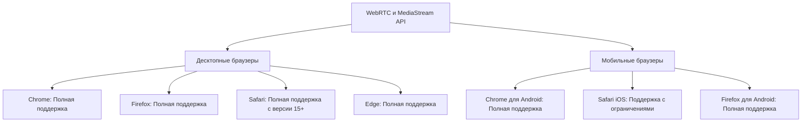
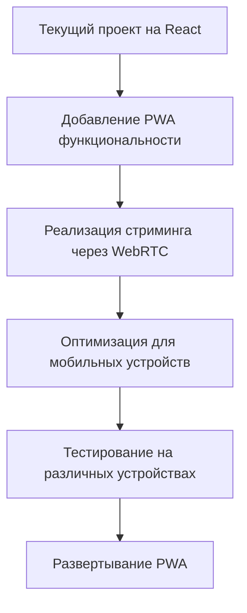

# Анализ возможности перехода с React Native на PWA

## 1. Текущее состояние проекта

- Проект находится на начальной стадии разработки
- Настроен базовый шаблон Vite + React + TypeScript
- React Native еще не реализован, он только планировался согласно архитектурному плану
- Основная функция мобильного приложения - возможность вести прямые трансляции с камеры мобильного устройства через RTMP/WebRTC на Ant Media Server

## 2. Техническая возможность реализации стриминга через браузер в PWA

### Поддержка WebRTC и MediaStream API в современных браузерах



### Ограничения PWA для стриминга

1. **iOS ограничения**:

   - Safari на iOS имеет ограничения на работу с камерой и микрофоном в фоновом режиме
   - Ограничения на длительность непрерывного доступа к камере/микрофону
   - Отсутствие поддержки некоторых расширенных функций WebRTC на iOS

2. **Энергопотребление**:

   - PWA может потреблять больше энергии при стриминге по сравнению с нативным приложением
   - Ограничения на длительную работу в фоновом режиме

3. **Качество стрима**:
   - Меньший контроль над настройками камеры по сравнению с нативным приложением
   - Ограниченные возможности оптимизации для конкретных устройств

### Преимущества PWA для стриминга

1. **Кроссплатформенность**:

   - Единая кодовая база для всех платформ
   - Нет необходимости поддерживать отдельные приложения для iOS и Android

2. **Простота распространения**:

   - Не требуется публикация в App Store или Google Play
   - Мгновенные обновления без необходимости переустановки

3. **Доступность**:
   - Пользователи могут начать использовать приложение сразу, без установки
   - Возможность установки на домашний экран для быстрого доступа

## 3. План миграции с React Native на PWA



### Этап 1: Добавление PWA функциональности

1. **Настройка манифеста веб-приложения**:

   ```javascript
   // public/manifest.json
   {
     "name": "Starvedas Streaming Platform",
     "short_name": "Starvedas",
     "start_url": "/",
     "display": "standalone",
     "background_color": "#ffffff",
     "theme_color": "#000000",
     "icons": [
       {
         "src": "icons/icon-192x192.png",
         "sizes": "192x192",
         "type": "image/png"
       },
       {
         "src": "icons/icon-512x512.png",
         "sizes": "512x512",
         "type": "image/png"
       }
     ]
   }
   ```

2. **Добавление Service Worker для офлайн-функциональности**:

   - Использование Workbox для упрощения работы с Service Worker
   - Кэширование статических ресурсов
   - Стратегии для API-запросов

3. **Обновление метаданных в index.html**:
   ```html
   <link rel="manifest" href="/manifest.json" />
   <meta name="theme-color" content="#000000" />
   <meta name="apple-mobile-web-app-capable" content="yes" />
   <meta name="apple-mobile-web-app-status-bar-style" content="black" />
   <link rel="apple-touch-icon" href="/icons/apple-icon-180.png" />
   ```

### Этап 2: Реализация стриминга через WebRTC

1. **Создание компонента для доступа к камере и микрофону**:

   ```tsx
   const StreamComponent: React.FC = () => {
     const videoRef = useRef<HTMLVideoElement>(null);
     const [stream, setStream] = useState<MediaStream | null>(null);

     const startStream = async () => {
       try {
         const mediaStream = await navigator.mediaDevices.getUserMedia({
           video: { facingMode: 'user' },
           audio: true,
         });

         if (videoRef.current) {
           videoRef.current.srcObject = mediaStream;
         }

         setStream(mediaStream);

         // Подключение к Ant Media Server через WebRTC
         // ...
       } catch (err) {
         console.error('Ошибка доступа к камере:', err);
       }
     };

     return (
       <div>
         <video ref={videoRef} autoPlay playsInline muted />
         <button onClick={startStream}>Начать стрим</button>
       </div>
     );
   };
   ```

2. **Интеграция с Ant Media Server**:

   - Использование WebRTC API для подключения к Ant Media Server
   - Настройка STUN/TURN серверов для обхода NAT
   - Реализация адаптивного битрейта

3. **Настройки качества стрима**:
   - Выбор разрешения видео
   - Настройка битрейта
   - Выбор камеры (фронтальная/задняя)

### Этап 3: Оптимизация для мобильных устройств

1. **Адаптивный дизайн**:

   - Использование CSS Grid и Flexbox для адаптивного макета
   - Оптимизация для различных размеров экрана
   - Поддержка жестов для мобильных устройств

2. **Оптимизация производительности**:

   - Минимизация перерисовок компонентов
   - Оптимизация работы с DOM
   - Использование Web Workers для тяжелых вычислений

3. **Энергосбережение**:
   - Оптимизация использования камеры и микрофона
   - Уменьшение частоты кадров при неактивном использовании
   - Автоматическое снижение качества при низком заряде батареи

### Этап 4: Тестирование на различных устройствах

1. **Кросс-браузерное тестирование**:

   - Chrome, Firefox, Safari, Edge
   - Chrome для Android, Safari для iOS

2. **Тестирование на различных устройствах**:

   - Смартфоны разных производителей
   - Планшеты
   - Десктопы

3. **Тестирование в различных сетевых условиях**:
   - Стабильное Wi-Fi соединение
   - Мобильные сети (4G/5G)
   - Нестабильное соединение

### Этап 5: Развертывание PWA

1. **Настройка HTTPS**:

   - Получение SSL-сертификата
   - Настройка перенаправления с HTTP на HTTPS

2. **Оптимизация загрузки**:

   - Разделение кода (code splitting)
   - Ленивая загрузка компонентов
   - Предварительная загрузка критических ресурсов

3. **Аналитика и мониторинг**:
   - Отслеживание производительности
   - Мониторинг ошибок
   - Сбор метрик использования

## 4. Сравнение React Native и PWA для стриминговой платформы

| Аспект                       | React Native                             | PWA                             |
| ---------------------------- | ---------------------------------------- | ------------------------------- |
| Доступ к нативным API        | Полный доступ                            | Ограниченный доступ             |
| Производительность стриминга | Высокая                                  | Средняя-высокая                 |
| Кроссплатформенность         | Требует отдельной сборки для iOS/Android | Единая версия для всех платформ |
| Распространение              | Через App Store/Google Play              | Через веб                       |
| Обновления                   | Требуют переустановки                    | Мгновенные                      |
| Доступ к камере в фоне       | Полный                                   | Ограниченный на iOS             |
| Настройки камеры             | Расширенные                              | Базовые                         |
| Время разработки             | Дольше                                   | Короче                          |
| Стоимость поддержки          | Выше                                     | Ниже                            |

## 5. Заключение и рекомендации

На основе проведенного анализа, переход с планируемого React Native на PWA для стриминговой платформы Starvedas является **технически возможным и целесообразным** по следующим причинам:

1. **Проект находится на начальной стадии разработки**, поэтому миграция не потребует переписывания существующего кода.

2. **Основная функциональность стриминга через RTMP/WebRTC доступна в современных браузерах** через WebRTC и MediaStream API.

3. **PWA предлагает значительные преимущества**:

   - Единая кодовая база для всех платформ
   - Простота распространения и обновления
   - Меньшие затраты на разработку и поддержку

4. **Ограничения PWA некритичны** для данного проекта:
   - Ограничения iOS на работу с камерой в фоновом режиме могут быть приемлемы для стриминговой платформы, где пользователь активно взаимодействует с приложением во время стрима
   - Базовые настройки камеры достаточны для большинства пользователей

Рекомендую реализовать стриминговую платформу как PWA с использованием React, TypeScript и WebRTC, что позволит достичь поставленных целей с меньшими затратами на разработку и поддержку.
